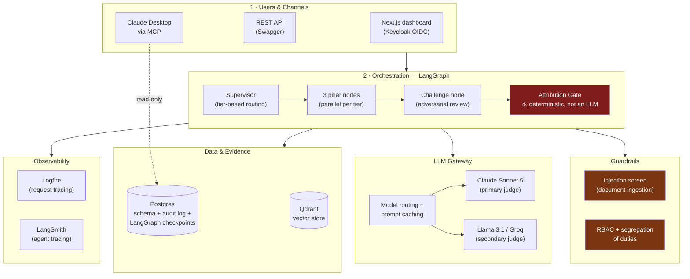
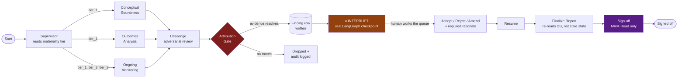
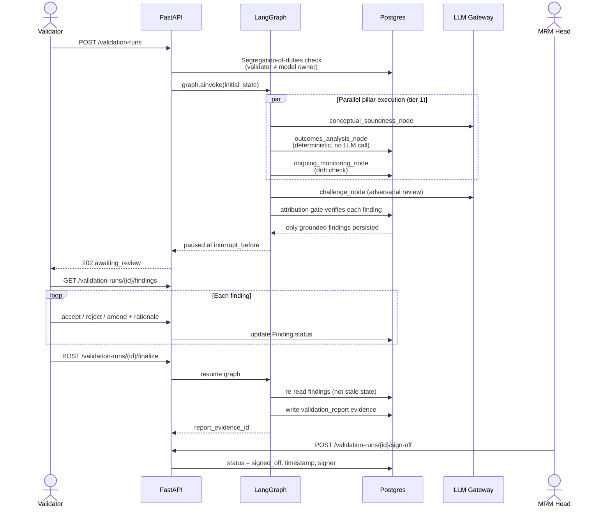
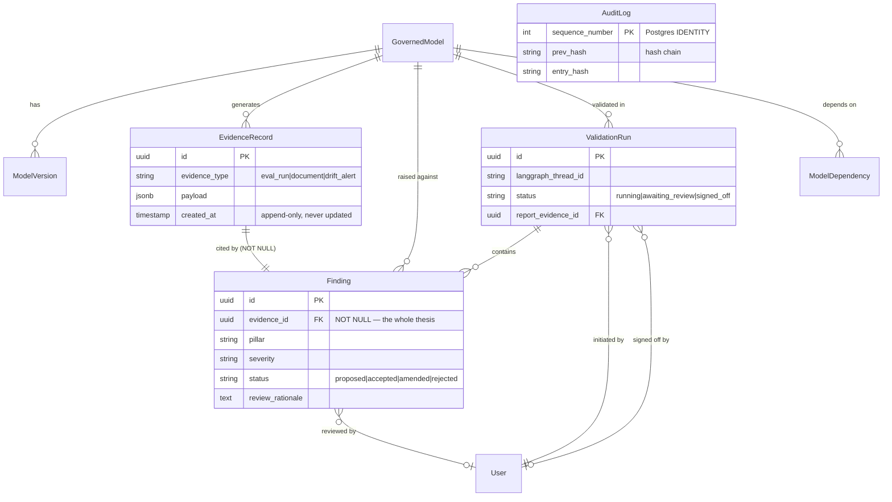
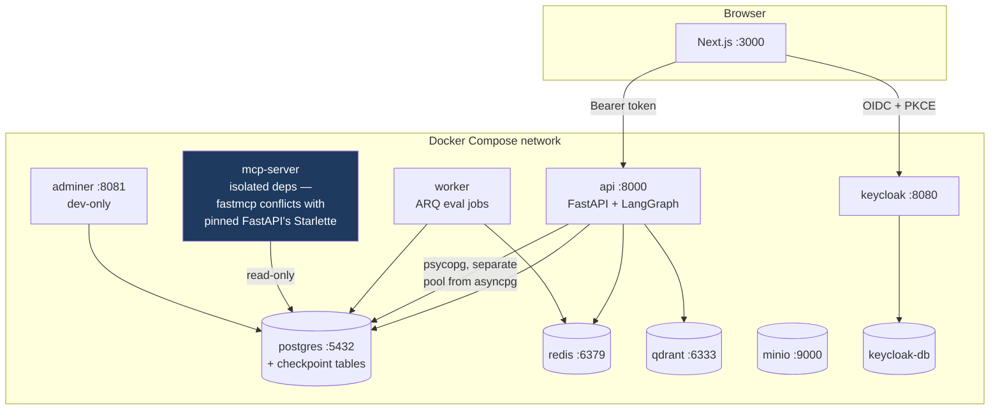
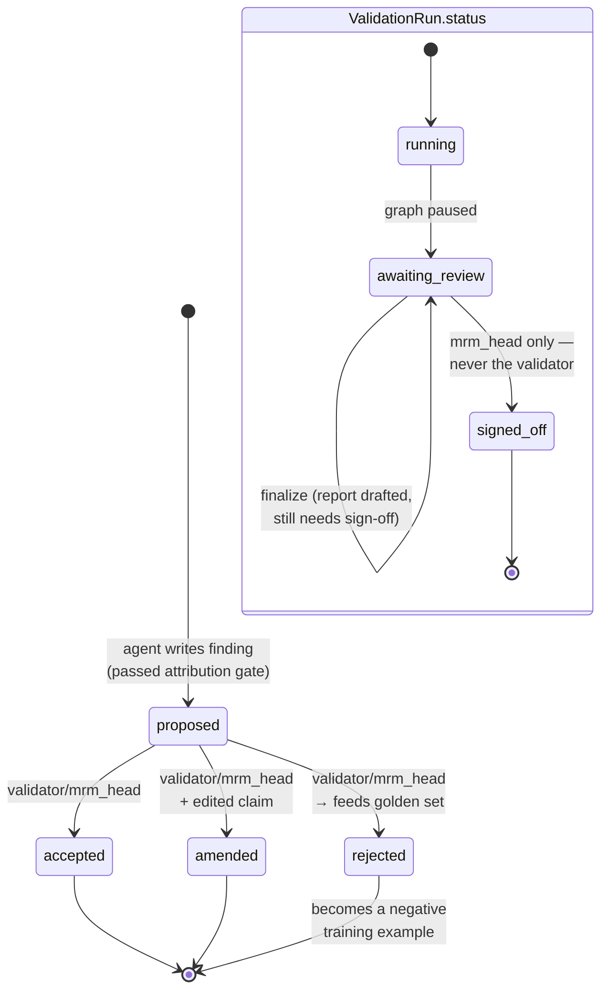

<div align="center">

# Attestor

### Model-risk governance for GenAI and agentic systems, built for the SR 26-2 regime

*A validation report is only as good as what it can prove.*

[](https://github.com/AaronFChristian/attestor/actions/workflows/ci.yml)


</div>

---

## The problem

Under the SR 26-2 model-risk regime, every GenAI and agentic system a bank
runs needs conceptual soundness review, outcomes analysis, and ongoing
monitoring — with a validation report an examiner can defend. The tools
being built for this problem in 2026 are almost all LLM-as-judge systems.
LLM-as-judge systems hallucinate. A validation agent that writes
*"faithfulness collapsed to 0.42"* is dangerous precisely because it
sounds credible — the number is specific, the claim is plausible, and
nobody manually re-derives it before it lands in a report a regulator
reads.

**Attestor's answer:** an AI validation agent proposes findings, but every
single finding is checked against real, resolvable evidence before it is
ever persisted. A finding with no matching evidence record does not get
written — not filtered out later, not softened, blocked at write time by
a deterministic gate that is not itself an LLM call.

---

## Table of contents

- [Architecture at a glance](#architecture-at-a-glance)
- [The validation pipeline](#the-validation-pipeline)
- [A validation run, end to end](#a-validation-run-end-to-end)
- [Data model](#data-model)
- [Deployment topology](#deployment-topology)
- [Finding & run lifecycle](#finding--run-lifecycle)
- [Key features](#key-features)
- [Tech stack](#tech-stack)
- [Repository structure](#repository-structure)
- [Getting started](#getting-started)
- [Testing](#testing)
- [Security & governance](#security--governance)
- [Honest production-readiness assessment](#honest-production-readiness-assessment)
- [Roadmap](#roadmap)

---

## Architecture at a glance



**Read this diagram as:** every arrow into the Attribution Gate is a
finding proposal; every arrow out is either a persisted database row or
nothing at all. Nothing about this system lets a proposed finding skip
that gate.

---

## The validation pipeline

This is the actual LangGraph topology in `app/agents/validation_graph.py`
— not a simplified version of it.



**The pause is not cosmetic.** By the time it happens, findings are
already real, persisted, human-reviewable database rows — not in-memory
graph state waiting to be formatted. `finalize_report_node` re-queries
`findings` from Postgres rather than trusting what the graph proposed, so
every accept/reject/amend decision made during the pause is what actually
lands in the final report. Backed by a Postgres-native checkpointer
(`langgraph-checkpoint-postgres`), so a paused run survives an API
restart and is visible to any replica — not held in one process's memory.

---

## A validation run, end to end



---

## Data model



**The one constraint that matters most in this schema:**
`Finding.evidence_id` is `NOT NULL`. That single column is the
database-level enforcement of the entire thesis — a finding without
resolvable evidence cannot exist as a row, full stop, independent of
whatever the LLM said.

---

## Deployment topology



**Why `mcp-server` is a separate service with its own Dockerfile:**
`fastmcp` requires Starlette ≥1.0; the pinned FastAPI needs Starlette
&lt;0.39. Rather than force one dependency tree to satisfy both — which
would mean freezing `fastmcp` forever or repeatedly upgrading FastAPI
across major versions just for one tool server — it runs isolated,
sharing only the ORM/config source (which has zero FastAPI dependency)
via `PYTHONPATH`, not a package install.

---

## Finding & run lifecycle



A **rejected** finding isn't a discarded one — it's written to
`attestor_self_golden` with `label_source='rejected_finding'`, becoming a
negative example that measures the validation agent's own false-finding
rate. Self-governance as a data pipeline, not a slogan.

---

## Key features

- **Deterministic attribution gate** — every finding's evidence is
  resolved against Postgres and its cited metric value compared to the
  stored eval run *before* the finding is persisted. A database lookup,
  not a second LLM call judging the first.
- **Dual-judge scoring** — Claude (Anthropic) and Llama (Groq) score every
  rubric criterion independently. Disagreement beyond a threshold escalates
  to mandatory human review — the concrete answer to "how do you know your
  judge isn't just agreeing with itself."
- **Real interrupt/resume** — a genuine LangGraph `interrupt_before`
  checkpoint, Postgres-backed, survives process restarts and is visible
  across replicas.
- **Segregation of duties, enforced server-side** — a validator cannot
  validate a model they own; sign-off is `mrm_head`-only, never the person
  who ran the review. Checked in the route handler, not just hidden in the UI.
- **Hash-chained, append-only audit log** — every write recomputes and
  verifies a SHA-256 chain. Documented limitation: detects
  application-level tampering, not an attacker with raw DB write access —
  said plainly rather than overclaimed.
- **Blast-radius lineage** — a recursive CTE walks model dependencies
  backward; a failing shared component auto-opens provisional findings on
  every downstream model.
- **Prompt-injection screening** — ingested document text is screened for
  injection patterns before it reaches an LLM prompt, flagged and
  audit-logged rather than silently stripped.
- **Materiality scoring is deterministic, not an LLM guess** — a fixed,
  weighted scorecard, because a risk tier that determines validation
  scrutiny has to be reproducible and arguable in plain arithmetic.

---

## Tech stack

| Layer | Choice | Why |
|---|---|---|
| API | FastAPI, Pydantic v2 | |
| Orchestration | LangGraph + `langgraph-checkpoint-postgres` | Postgres-backed, not in-memory — survives restarts, works across replicas |
| Database | Postgres 16 + Alembic | |
| Vector store | Qdrant | |
| Auth | Keycloak (OIDC, PKCE), RBAC + ABAC | |
| LLM providers | Claude (Anthropic), Llama (Groq) | Dual-judge, different model families |
| Observability | Logfire + LangSmith | Request tracing + agent-level tracing |
| Frontend | Next.js 16, React 19, TypeScript, Tailwind 4 | `keycloak-js` official adapter, not hand-rolled OIDC |
| Async jobs | ARQ on Redis | |
| CI | GitHub Actions — lint/type/test, SAST (bandit), dependency audit, secret scan (gitleaks), blocking eval-regression gate | |

---

## Repository structure

```
attestor/
├── app/
│   ├── agents/        # LangGraph nodes, state, graph construction
│   ├── core/           # config, database, auth
│   ├── evals/          # scorers, dual-judge, eval runner
│   ├── gateway/         # LLM gateway, ARQ worker
│   ├── guardrails/       # attribution gate, injection screen
│   ├── models/           # SQLAlchemy ORM + Pydantic schemas
│   ├── routers/            # FastAPI route handlers
│   └── services/            # materiality, audit, lineage, drift
├── frontend/               # Next.js app
├── mcp_server/               # isolated FastMCP server (see deployment topology)
├── alembic/                    # migrations
├── tests/                        # unit + integration
└── .github/workflows/ci.yml        # lint, security, eval gate
```

---

## Getting started

```bash
cp .env.example .env
# fill in ANTHROPIC_API_KEY, GROQ_API_KEY

chmod +x scripts/bootstrap.sh
./scripts/bootstrap.sh   # containers, migrations, Keycloak users, seed data

cd frontend
npm install
cp .env.local.example .env.local
npm run dev
```

Open `http://localhost:3000`. Demo credentials are generated fresh on
every bootstrap and written to `.env.local` at the repo root (gitignored)
— never hardcoded, never committed.

---

## Testing

```bash
uv run pytest tests/unit tests/integration -v
```

Unit tests cover the materiality scorecard, the audit hash chain
(including a simulated tamper-detection scenario), the Jaccard
tool-correctness metric, dual-judge parsing, and the injection screen.
Integration tests run the attribution gate against a real database,
including negative controls: fabricated evidence, cross-model citation,
and misreported metric values are all proven rejected, not just assumed.

---

## Security & governance

| Role | Can | Cannot |
|---|---|---|
| `model_owner` | Register models, view findings against them | Validate a model they own, close a finding |
| `validator` | Trigger runs, review the finding queue | Sign off their own report |
| `mrm_head` | Sign off finalized reports, set thresholds | — |
| `auditor` | Read everything | Write anything |

Every restriction above is enforced in the route handler (`app/core/auth.py`,
`app/routers/validation.py`), not only hidden in the UI.

---

## Honest production-readiness assessment

This is a portfolio project, and the strongest thing it can show is not a
claim of completeness but an accurate map of what's actually proven.

**Fully proven, live, against real infrastructure:** schema, auth, audit
chain, LLM gateway, dual-judge evals, attribution gate (with negative
controls), the LangGraph agent including a real interrupt/resume survived
across an API restart, the full HITL review workflow through the actual
UI including a real sign-off, and a green CI pipeline with a
demonstrably-blocking eval gate.

**Built but never exercised on real data:** blast-radius lineage (no
`model_dependencies` row has ever been inserted), distribution drift
detection (written, never called by any node), the self-governance
feedback loop (rejected findings are correctly collected, nothing yet
*reads* that data to compute the agent's own false-finding rate).

**Named in the original design, not built:** RAG retrieval in the agent
(Qdrant is running, nothing queries it yet — `conceptual_soundness_node`
reads evidence rows directly), NeMo Guardrails, a red-teaming module,
PDF report export.

**The one architectural fact that would have blocked calling this
"production-grade":** the LangGraph checkpointer was originally
`MemorySaver` — in-process memory. Two API replicas behind a load
balancer would have made a paused run invisible to whichever replica
didn't start it. This has been fixed
(`langgraph-checkpoint-postgres`, confirmed working across a live restart),
but the fact that it needed fixing is worth saying plainly rather than
glossing over.

---

## Roadmap

- [ ] Wire Qdrant retrieval into `conceptual_soundness_node`
- [ ] Close the self-governance loop — score the validation agent against
      its own rejected-finding golden set on a schedule
- [ ] Seed real `model_dependencies` and exercise blast-radius for real
- [ ] Findings review workspace: bulk actions, filtering
- [ ] PDF export for signed-off reports

---

<div align="center">

Built by [Aaron Christian](https://github.com/AaronFChristian) ·
[LinkedIn](#) · aaronfc.work@gmail.com

</div>
